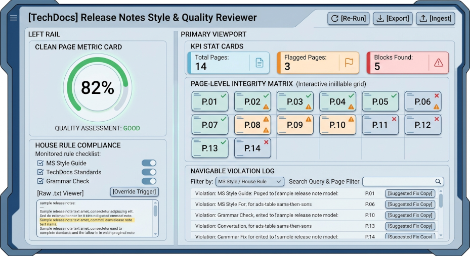

# Release Notes Style & Quality Reviewer — User Guide

The Release Notes Style & Quality Reviewer is an automated quality assurance and technical editing tool designed for technical documentation teams, product managers, and release engineers. It critiques release notes against the Microsoft Writing Style Guide and custom House Rules, computing a binary Clean Page Metric and generating an actionable, page-by-page remediation report.

---

## Key Concepts & Scoring Methodology

### The Clean Page Metric
Unlike line-item word checkers, this reviewer evaluates quality through a binary page-level integrity model:
* 0 Violations on a page = Clean Page
* 1 or more Violations on a page = Flagged Page

The overall score is calculated as:
Integrity Tiers
* 90% – 100%: High Quality Integrity — Document meets editorial standards and is ready for release.
* 70% – 89%: Revisions Recommended — Minor style violations or house rule deviations requiring review.
* Below 70%: Substantial Violations — Systematic quality issues requiring editorial restructuring before publication.

### House Rule Veto Priority
Technical documentation often requires project-specific exceptions to standard style manuals (e.g., specific brand naming conventions, mandatory legal disclaimers, or customized formatting).
* Primary Authority: House Rules always override the Microsoft Writing Style Guide.
* Conflict Resolution: If a House Rule conflicts with a Microsoft Style recommendation, the House Rule always wins. The engine will never penalize compliance with a documented House Rule.

### Exclusion & Auto-Pass Logic
To avoid false positives and noise, the engine automatically applies domain-specific filters:
* Table of Contents (TOC): Automatically detected and assigned an automatic Clean Pass.
* Legal & Copyright Notices: Automatically detected and assigned an automatic Clean Pass.
* Technical Identifiers: Terminal commands, CLI flags (--verbose), file system paths (/var/log/...), environment variables, code snippets, and database column names are automatically exempt from prose style critique.

---

## Getting Started & Ingestion Workflow

### Supported File Formats
**Release Notes**
* PDF (.pdf): Extracted per page with layout blocks, headings, and visual coordinates.
* Plain Text (.txt): Parsed using page delimiters (--- Page N ---).
  
**House Rules**
* Text file (.txt): Plain text listing one rule or guideline per line/paragraph.

### Uploading Documents & House Rules
1. In the top navigation header, click Ingest New Files.
2. Upload Release Notes:
* Drag and drop your .pdf file into the left drop zone, or click Browse Files.
3. Provide House Rules:
* Drag and drop your HouseRules.txt file into the right drop zone, or click Browse Files.
4. Click Run Dual-Pass Quality Audit. The system will parse the pages, identify section anchors, and evaluate the text.

### Editing House Rules In-App
You do not need to re-upload your .txt file every time you want to test a rule change:
1. Open the Ingest New Files dialog.
2. Under House Rules, review or directly edit the text in the provided editor box.
3. Click Run Dual-Pass Quality Audit to re-evaluate the document against the updated rules.

### Using Preloaded Sample Data
If you want to explore the reviewer without uploading your own documents:
1. Click Ingest New Files.
2. Click Load Sample Release Notes & House Rules at the top right of the modal.
3. Click Run Dual-Pass Quality Audit to load a 14-page enterprise sample complete with intentional style nuances, deprecation notices, and house rule overrides.

---

## Dashboard Walkthrough


### Clean Page Metric & KPI Cards
* Clean Page Metric (Left Rail): Displays the calculated percentage, visual status ring, and qualitative rating.
* Top KPI Cards:
* Total Pages: Total pages evaluated along with the count of clean pages.
* Flagged Pages: Total count and percentage of pages containing at least one issue.
* Blocks Reviewed: Total number of distinct section blocks audited and total violations logged.

### House Rule Compliance Checklist
Located below the metric gauge on the left rail:
* Rule Verification: Displays every active house rule parsed from your .txt file.
* Checkmark Badge (✓): Indicates the rule was actively enforced.
* Warning/Override Badge (!): Indicates a House Rule Veto Override was triggered, successfully protecting valid copy that would have otherwise triggered a Microsoft Style violation.
* Raw .txt Toggle: Click Raw .txt to review the exact rule definitions loaded into the session.

### Page-Level Integrity Matrix
A visual grid showing all pages of the ingested document:
* Green Tile (Clean): Page passed with zero violations.
* Rose Tile (Flagged): Page contains one or more violations.
* Indigo Tile (Auto-Pass): Page recognized as a Table of Contents or Legal notice and exempted.
* Interactive Page Selection: Clicking any tile opens the Page Inspector Modal.

### Page Inspector Modal
Allows deep inspection of an individual page:
* Left Panel: Full extracted text of the selected page, broken down by section headings and block types.
* Right Panel: A list of violations specific to that page, showing the original text snippet, rule citation, and suggested fix.

### Navigating the Violation Log
The Violation Log provides an actionable table of all detected defects:
* Search Bar: Search across section names, rule titles, original text, and suggestions.
* Type Filter: Filter table rows by:
* All: View all issues.
* House Rule: View only house rule violations.
* MS Style: View only Microsoft Style Guide issues.
* Page Dropdown: Narrow the log to inspect a single page.
* Row Expansion: Click any row to reveal the detailed Audit Rationale explaining the linguistic rule.

---

## Remediation & Export Workflow

### Applying & Copying Suggested Fixes
Every row in the Violation Log contains a pre-computed replacement snippet:
1. Locate the item in the table.
2. In the Suggested Fix column, review the highlighted correction.
3. Click the Copy icon button on the right side of the fix box.
4. Paste the corrected text directly into your authoring tool (e.g., Markdown, Word, Google Docs, or CMS).

### Exporting Markdown Reports
To share audit findings with your documentation team or attach them to a CI/CD pull request:
1. In the header bar, click Export Markdown.
2. The app generates and downloads a clean, GitHub-flavored Markdown report (Release_Notes_Review_Report.md) containing:
* Executive Summary and Clean Page Score.
* Core KPI metrics breakdown.
* Comprehensive table of all violations with page and section anchors.
* Status log of House Rules and active overrides.

### Re-Running Audits
Click Re-Run Audit in the top navigation bar at any time to re-evaluate the currently loaded document without re-uploading files.

---

## Writing Effective House Rules
To get the highest accuracy from the audit engine, format your HouseRules.txt file with clear, imperative guidelines.

### Recommended Format Examples
```
# CloudNexus House Rules (v2.1)

Rule 1 (Brand Nomenclature): Always refer to the product by its complete name "CloudNexus Studio". Never use "the tool" or "Nexus".

Rule 2 (UI Formatting): All user interface elements (buttons, menus, dialog names, tab titles) must be bolded using asterisks (e.g., **Save Changes**).

Rule 3 (Action Verbs): Use "Select" or "Choose" instead of "Click" when describing user interactions to maintain device accessibility.

Rule 4 (Phrasing Restrictions): Never use "utilize", "in order to", or conversational politeness markers like "please" in numbered procedures.

Rule 5 (Deprecation Notice Standard - Override): The exact string "Notice: This feature has been scheduled for deprecation in release 4.0." is approved and must not be flagged for passive voice.
```

### Tips for High Precision
* State prohibited terms explicitly: Mention both the prohibited word and the preferred substitute (e.g., Use "Select" instead of "Click").
* Flag intentional exceptions as overrides: If your company uses a specific legal or technical phrasing that standard grammar checkers flag, explicitly document it as an approved standard.

---

## Engine Architecture & Reliability
The application uses a resilient dual-layer architecture to ensure continuous availability:
1. AI Review Engine (Primary):
* Uses server-side Gemini high-reasoning models (gemini-3.8-flash with automatic fallback to gemini-flash-latest and gemini-3.1-flash-lite).
* Interprets complex grammatical context, structural tone, and cross-rule precedence.
2. Deterministic Rules Engine (Automatic Fallback):
* If the external API is unreachable or experiences rate-limiting, the application automatically engages an internal deterministic rules engine.
* Ensures reports, page matrices, and audits continue to function without interruption.

